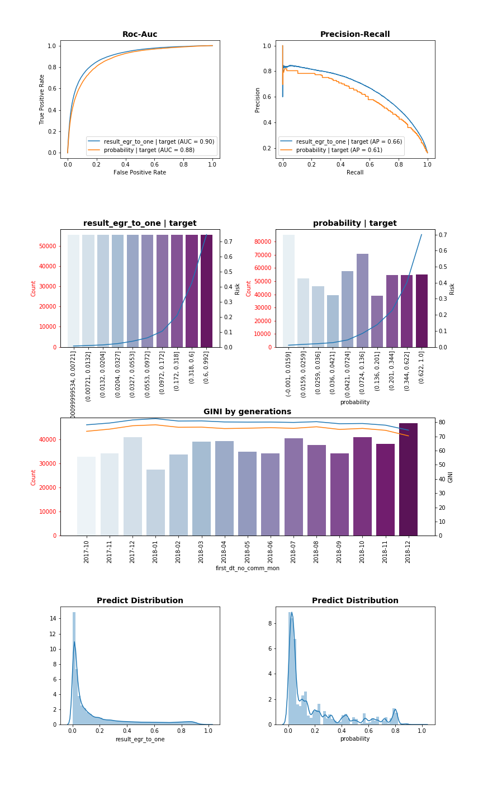
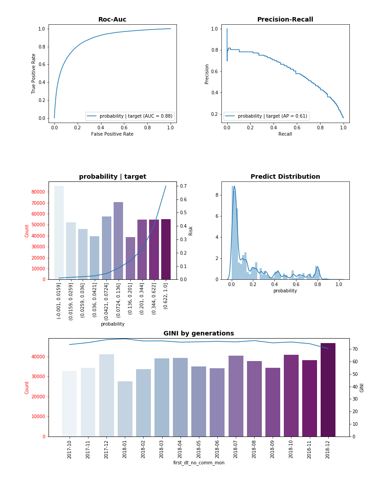

# CrossPredict
[](https://badge.fury.io/py/crosspredict)
[](https://crosspredict.readthedocs.io/en/latest/?badge=latest)

* The library makes cross validation and reports generation easy
* Easy to extend to other models
* Supports Lightgbm, XGBoost
* Supports different crossvalidation strategies:
    * Supports crossvalidation by users (RepeatedKFold)
    * Supports stratified crossvalidation by target column (RepeatedStratifiedKFold)
    * Supports simple crossvalidation (RepeatedKFold)
* Easy use of target encoding with double crossvalidation
* Supports target encoding library category_encoders


## Table of contents
- [Installation](#installation)
- [ReportsPreview](#reportspreview)
- [Target Encoding with DoubleCrossValidation](#target-encoding-with-doublecrossvalidation)
- [How to use](#how-to-use)
- [Authors](#authors)

## Installation
```bash
python -m pip install crosspredict
```

## ReportsPreview
```python
#precalculates all metrics
a = ReportBinary(cols_score = ['result_egr_to_one','probability'], 
                 cols_target=['target'],
                 col_generation_deals='first_dt_no_comm_mon'
                )
a.fit(df) 
```
``` python
a.plot_report(report_shape = (4,2),
              report={'roc-auc':  {'loc':(0, 0)},
                      'precision-recall': [{'loc':(0, 1)}],
                      'mean-prob': [{'loc':(1, 0)},{'loc':(1, 1)}],
                      'gen-gini': {'loc':(2,0), 'colspan':2},
                      'distribution': [{'loc':(3,0)},{'loc':(3,1)}]
                     }
             )
a.fig.savefig('report1.png')
```
 
```python
a.plot_report(report_shape = (3,2),
              report={'roc-auc':  {'loc':(0, 0)},
                      'precision-recall': {'loc':(0, 1)},
                      'mean-prob': {'loc':(1, 0)},
                      'gen-gini': [{'loc':(2,0), 'colspan':2}],
                      'distribution': {'loc':(1,1)}
                     },
              cols_score=['probability']) 
a.fig.savefig('report2.png')
```


## Target Encoding with DoubleCrossValidation
```python
# creates iterator
iter_df = Iterator(n_repeats=3,
                    n_splits=10,
                    random_state = 0,
                    col_client = 'userid',
                    cv_byclient=True)

# fits target encoder (creates mappings for each fold)
cross_encoder = CrossTargetEncoder(iterator = iter_df,
                                    encoder_class=WOEEncoder,
                                    n_splits= 5,
                                    n_repeats= 3,
                                    random_state= 0,
                                    col_client= 'userid',
                                    cv_byclient= True,
                                    col_encoded= 'goal1',
                                    cols= ['field3','field2','field11','field23','field18','field20']
                                  )
cross_encoder.fit(train)

# train cross validation models
model_class = CrossLightgbmModel(iterator=iter_df, 
                                 feature_name=feature_name,
                                 params=params,
                                 cols_cat = ['field3', 'field2', 'field11', 'field23', 'field18', 'field20'],
                                 num_boost_round = 9999,
                                 early_stopping_rounds = 50,
                                 valid = True,
                                 random_state = 0,
                                 col_target = 'goal1',
                                 cross_target_encoder = cross_encoder)
result = model_class.fit(train)
```
## How to use

**Plot Reports for Binary Classification problem example** - [`Plot Reports for Binary Classification problem example.ipynb`](https://github.com//crosspredict/crosspredict/blob/master/notebooks/Plot Reports for Binary Classification problem example.ipynb)

**Simple_example_in_one_Notebook** - [`Simple_example_in_one_Notebook.ipynb`](https://github.com//crosspredict/crosspredict/blob/master/notebooks/Simple_example_in_one_Notebook.ipynb)

**Iterator_class** - [`Iterator_class.ipynb`](https://github.com//crosspredict/crosspredict/blob/master/notebooks/Iterator_class.ipynb)

**CrossModelFabric_class** - [`CrossModelFabric_class.ipynb`](https://github.com//crosspredict/crosspredict/blob/master/notebooks/CrossModelFabric_class.ipynb)

**CrossTargetEncoder_class** - [`CrossTargetEncoder_class.ipynb`](https://github.com//crosspredict/crosspredict/blob/master/notebooks/CrossTargetEncoder_class.ipynb)

## Authors

[Vladislav Boyadzhi](www.linkedin.com/in/vladislav-boyadzhi)